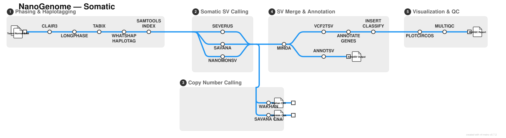
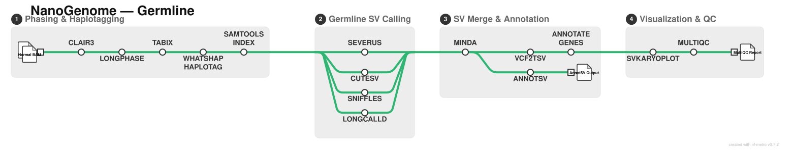

# shahcompbio/nanogenome

[](https://github.com/codespaces/new/shahcompbio/nanogenome)
[](https://github.com/shahcompbio/nanogenome/actions/workflows/nf-test.yml)
[](https://github.com/shahcompbio/nanogenome/actions/workflows/linting.yml)[](https://doi.org/10.5281/zenodo.XXXXXXX)
[](https://www.nf-test.com)

[](https://www.nextflow.io/)
[](https://github.com/nf-core/tools/releases/tag/4.0.2)
[](https://docs.conda.io/en/latest/)
[](https://www.docker.com/)
[](https://sylabs.io/docs/)
[](https://cloud.seqera.io/launch?pipeline=https://github.com/shahcompbio/nanogenome)

## Introduction

**shahcompbio/nanogenome** is a bioinformatics pipeline for comprehensive analysis of long-read DNA sequencing data. The pipeline performs variant calling, phasing, structural variant (SV) detection, copy number aberration (CNA) analysis, transposable element (TE) insertion calling, and gene annotation from Oxford Nanopore Technologies (ONT) sequencing data. It supports both somatic (tumor-normal) and germline analysis workflows with ensemble calling approaches for improved accuracy.

The pipeline is built using [Nextflow](https://www.nextflow.io), a workflow tool to run tasks across multiple compute infrastructures in a very portable manner. It uses Docker/Singularity containers making installation trivial and results highly reproducible. The [Nextflow DSL2](https://www.nextflow.io/docs/latest/dsl2.html) implementation of this pipeline uses one container per process which makes it much easier to maintain and update software dependencies.

## Pipeline summary

### Somatic workflow

<p align="center">
    
</p>

### Germline workflow

<p align="center">
    
</p>

1. Variant calling and phasing ([`Clair3`](https://github.com/HKU-BAL/Clair3), [`LongPhase`](https://github.com/twolinin/LongPhase))
2. BAM haplotagging ([`WhatsHap`](https://whatshap.readthedocs.io/))
3. Somatic structural variant calling with ensemble approach
   - Individual callers: [`SEVERUS`](https://github.com/KolmogorovLab/Severus), [`SAVANA`](https://github.com/cortes-ciriano-lab/savana), [`NanoMonSV`](https://github.com/friend1ws/nanomonsv)
   - Consensus calling: [`MINDA`](https://github.com/shahcompbio/minda)
4. Germline structural variant calling (optional)
   - Individual callers: [`SEVERUS`](https://github.com/KolmogorovLab/Severus), [`Sniffles`](https://github.com/fritzsedlazeck/Sniffles), [`CuteSV`](https://github.com/tjiangHIT/cuteSV), [`LongcallD`](https://github.com/ydLiu-HIT/LongcallD)
   - Consensus calling: [`MINDA`](https://github.com/shahcompbio/minda)
5. Somatic SNV/indel calling ([`ClairS`](https://github.com/HKU-BAL/ClairS), [`DeepSomatic`](https://github.com/google/deepsomatic)) with VEP annotation via [`vcf2maf`](https://github.com/mskcc/vcf2maf)
6. Haplotype-resolved copy number analysis ([`Wakhan`](https://github.com/shahcompbio/wakhan), [`SAVANA`](https://github.com/cortes-ciriano-lab/savana))
7. Transposable element insertion calling (optional)
   - Individual callers: [`LongcallD`](https://github.com/ydLiu-HIT/LongcallD), [`tldr`](https://github.com/adamewing/tldr)
   - Somatic (tumor-normal) and germline TE calling modes
   - AnnotSV annotation of TE insertions
8. Mobile element classification of somatic insertions and single breakends (optional, `--classify_inserts`)
   - Insertion classification (L1, Alu, SVA, processed pseudogene, VNTR) with [`nanomonsv insert_classify`](https://github.com/friend1ws/nanomonsv)
   - Single-breakend classification with BWA and RepeatMasker annotation
9. SV and CNA annotation ([`BioMart`](https://www.ensembl.org/info/data/biomart/index.html), [`OncoKB`](https://www.oncokb.org/), [`AnnotSV`](https://lbgi.fr/AnnotSV/))
10. Visualization of SVs and CNAs (Circos for somatic, karyoplot for germline)
11. Present QC for all workflow stages ([`MultiQC`](http://multiqc.info/))

## Usage

> [!NOTE]
> If you are new to Nextflow and nf-core, please refer to [this page](https://nf-co.re/docs/get_started/environment_setup/overview) on how to set-up Nextflow. Make sure to [test your setup](https://nf-co.re/docs/get_started/run-your-first-pipeline) with `-profile test` before running the workflow on actual data.

First, prepare a samplesheet with your input data that looks as follows:

`samplesheet.csv`:

```csv
sample,condition,bam,bai,snp_vcf,snp_tbi,severus_vcf
SAMPLE_TUMOR,tumor,/path/to/tumor.bam,/path/to/tumor.bam.bai,,,
SAMPLE_NORMAL,normal,/path/to/normal.bam,/path/to/normal.bam.bai,,,
```

Each row represents a sample with the following columns:

- `sample`: Sample identifier (must be the same for tumor-normal pairs)
- `condition`: Either `tumor` or `normal`
- `bam`: Full path to aligned BAM file
- `bai`: Full path to BAM index file
- `snp_vcf`: (Optional) Path to pre-phased SNP VCF file (required if `--skip_phasing` is used)
- `snp_tbi`: (Optional) Path to VCF index file
- `severus_vcf`: (Optional) Path to pre-computed Severus SV VCF
- `annotated_sv_tsv`, `nanomonsv_result_txt`, `sbnd_result_txt`: (Optional) Pre-computed inputs for standalone classification with `--classify_inserts --skip_somatic`; see [usage docs](docs/usage.md#samplesheet-input)

Now, you can run the pipeline using:

```bash
nextflow run shahcompbio/nanogenome \
   -profile docker \
   --input samplesheet.csv \
   --outdir <OUTDIR> \
   --fasta <REFERENCE_FASTA> \
   --fai <REFERENCE_FAI>
```

> [!WARNING]
> Please provide pipeline parameters via the CLI or Nextflow `-params-file` option. Custom config files including those provided by the `-c` Nextflow option can be used to provide any configuration _**except for parameters**_; see [docs](https://nf-co.re/docs/running/run-pipelines#using-parameter-files).

## Credits

shahcompbio/nanogenome was originally written by Asher Preska Steinberg.

We thank the following people for their extensive assistance in the development of this pipeline:

- [@marcjwilliams1](https://github.com/marcjwilliams1)
- Claude Code (AI assistant)

## Contributions and Support

If you would like to contribute to this pipeline, please see the [contributing guidelines](docs/CONTRIBUTING.md).

## Citations

<!-- TODO nf-core: Add citation for pipeline after first release. Uncomment lines below and update Zenodo doi and badge at the top of this file. -->
<!-- If you use shahcompbio/nanogenome for your analysis, please cite it using the following doi: [10.5281/zenodo.XXXXXX](https://doi.org/10.5281/zenodo.XXXXXX) -->

<!-- TODO nf-core: Add bibliography of tools and data used in your pipeline -->

An extensive list of references for the tools used by the pipeline can be found in the [`CITATIONS.md`](CITATIONS.md) file.

This pipeline uses code and infrastructure developed and maintained by the [nf-core](https://nf-co.re) community, reused here under the [MIT license](https://github.com/nf-core/tools/blob/main/LICENSE).

> **The nf-core framework for community-curated bioinformatics pipelines.**
>
> Philip Ewels, Alexander Peltzer, Sven Fillinger, Harshil Patel, Johannes Alneberg, Andreas Wilm, Maxime Ulysse Garcia, Paolo Di Tommaso & Sven Nahnsen.
>
> _Nat Biotechnol._ 2020 Feb 13. doi: [10.1038/s41587-020-0439-x](https://dx.doi.org/10.1038/s41587-020-0439-x).
